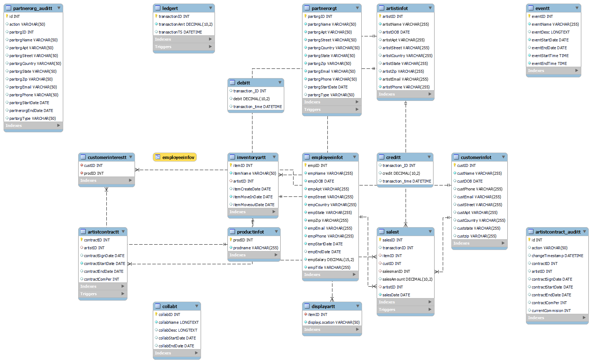
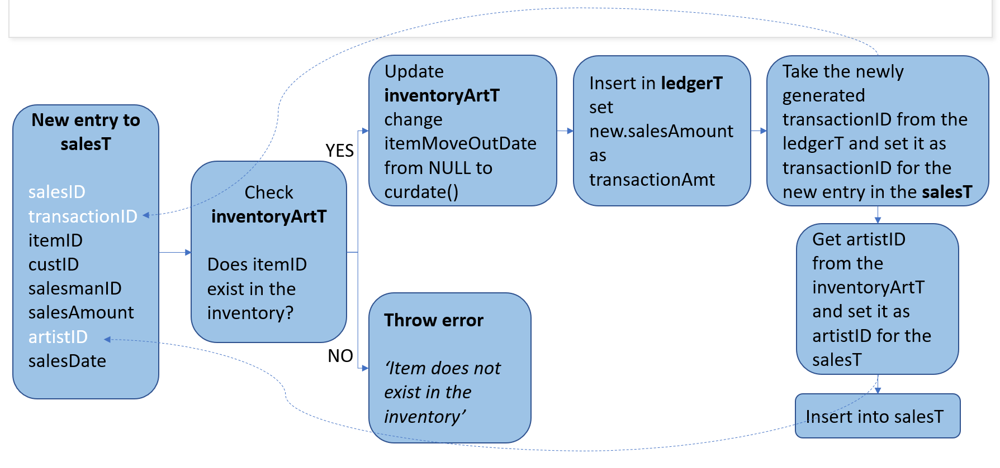

# Art Gallery Database Management System

## Overview

This project is a database management system for art galleries. It automates the following tasks:

* Artwork inventory management and tracking
* Adding and updating artwork information
* Viewing and searching artwork by artist, category, or other criteria
* Sales and cashflow management
* Customer relationship management (CRM)
* Maintaining or updating artist contracts
* Creating reports to analyze employee performance

## Database Schema

The database schema consists of 17 tables with primary and foreign key constraints along with some check constraints. A list of all the tables used in this project can be found below:

* ArtistInfoT
* EventT
* EmployeeInfoT
* CustomerInfoT
* ProductInfoT
* CustomerInterestT
* InventoryArtT
* PartnerOrgT
* DisplayArtT
* LedgerT
* CreditT
* DebitT
* CollabT
* ArtistContractT
* SalesT
* artistcontract_auditT
* partnerOrg_auditT

The corresponding ER Diagram is displayed below:

It also includes indexes and views for user-level security:

* Indexes: salesmanIDI, artistIDI
* Views: EmployeeInfoV

## Stored Programs

The project automates many functionalities using triggers, functions, and procedures:

### 1. Triggers
* `artistcontract_updateT`: This pre-update trigger stores all old values in `artistcontract_auditT` when an artist renews his contract.
* `pastPartnerOrg_deleteT`: This pre-delete trigger stores old values in `partnerOrg_auditT` when a partner organization is removed from the database.
* `ledger_creditT`: This post-insert trigger checks the transaction amount and inserts an entry into either the `creditT` or `debitT` table depending on the kind of transaction i.e. credit or debit.
* `sales_entryT`: This pre-insert trigger -
  * checks if the item exists in the inventory else throws an error
  * updates itemmoveoutdate in the inventoryartt from null to curdate() [item moved out from the inventory]
  * inserts a new entry into ledgert
  * adds transactionid to salest from ledgert
  * adds artistID to salesT from inventoryartt
  
  Here's a flowchart for the same:
    

### 2. Functions
* `totalPurchase()`: This function returns the total purchase made by a customer using their customerID.
* `totalSales()`: This function returns the total sales made by an artist using their artistID.

### 3. Stored Procedures
* `GetCustomerLevel`: This procedure categorizes the customers into three levels: SILVER, GOLD, and PLATINUM by assessing their total purchase with the gallery. It uses the `totalPurchase()` function to get the total purchase of a customer. It returns 'Invalid ID' if the customer is not found in the database.
* `GetArtistLevel`: This procedure categorizes the artists into four levels: ROOKIE, NOVICE, EXPERT, and GENIUS by assessing their total sales. It uses the `totalSales()` function to get the total sales made by an artist. It returns 'Invalid ID' if the artist is not found in the database.
* `GetPlanner`: This procedure takes an input date and returns the planned events for the day.

## Queries
The project contains a total of 16 queries that can be used to analyze the data in the database. These queries use concepts such as filtering, subqueries, joins, and in-built functions.
1. Display all the art pieces along with the names of the artists who created them and the year in which they were created that are displayed in hall 1 (DisplayArtT and InventoryArtT)
2. Display all the sales made in the month of Nov 2022 (salesT and inventoryArtT and customerInfoT)
3. To find the employee of the month of November (max total sales) in the year 2022 (SalesT and EmployeeInfoT)
4. Best performing (Top 5) artists in the year 2022
5. Least performing art pieces (Top 5 DESC)
6. List all the customers that belong to a particular area (zipcode = x) and are interested in newsletters (productID = 3005)
7. List all the paintings that are priced higher than the average price of all the paintings sold in the gallery (subquery)
8. List the months of 2022 in descending order of the total sales
9. List average/total sales for the month of November 2022
10. List the customers who have not purchased anything from the gallery
11. List the customers who have not purchased anything from the gallery for the last five years
12. Display sales with 3rd highest sales amount for each year
13. Calculate the total commission earned by an artist given the artist ID = 1001
14. Calculate average yearly sales made by an artist and the commission he earned for it over the years (artist ID = 1001)
15. Calculate average yearly sales made by a salesman (salesmanID = 2006)
16. Find all the customers who have an interest in the products of the art gallery and have their birthday today and what product they are interested in

## Getting Started

To get started with this project, you will need to have the following installed:

* MySQL Workbench

Once you have these installed, you can follow these steps to set up the project:

1. Clone the repository to your local machine.
2. Import and run the `ArtGallerySchema.sql` file.

The .sql file contains dummy data to test and run necessary functionalities.

